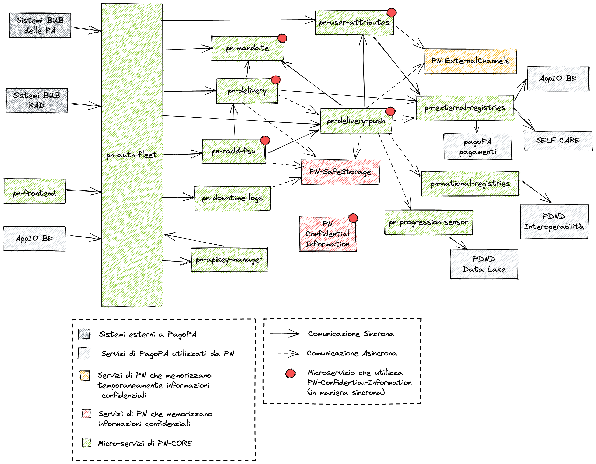
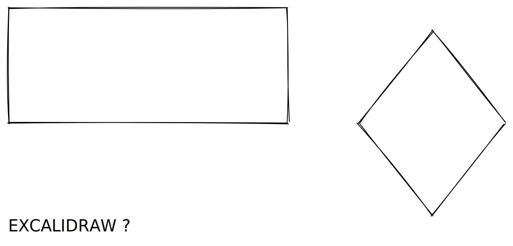

# doc

## Primo Markdown con Gitbook

La prima impressione è che la parte di editing WYSIWYG (ammesso che si scriva così) va migliorata parecchio.

Mi aspettavo almeno una toolbar per aggiungere dei link e caricare delle immagini, spero di scoprire come si fa.

<figure><figcaption><p>Un immagine</p></figcaption></figure>

Ok, immagini inserite.

```mermaid
```

Per i diagrammi c'è mermaid che è carino ma non paragonabile a draw.io




[page-1.md](doc/infrastructure/page-1.md)


Un link a [google](https://google.it).
